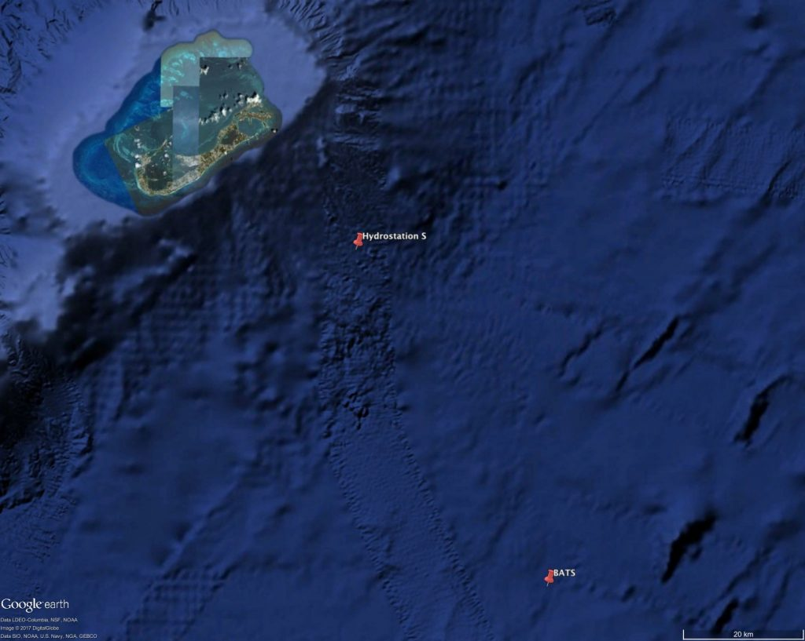

## Introduction
Ocean acidification is stated as being the change in the ocean's chemistry caused by the uptake of molecules of CO~2~ (Guionette & Fabry 2008)(NOAA), but can also be caused by the uptake and subtraction of other chemical species such nitrogen and sulfur compounds (Guionette & Fabry 2008). While this process does occur naturally, in modern times is caused mostly by large amounts of CO~2~ being released into the atmosphere due to anthropogenic climate change such as the burning of fossil fuels and deforestation (Doney et al. 2009). This has made the CO~2~ concentration steadily increased since the industrial revolution during the 1800's. If not for the ocean's uptake, the concentration of CO~2~ would be significantly higher that the measured concentration today (Doney et al. 2009). Although this uptake by the ocean also brings its own set of problems, such as the lowering of seawater's pH. In this lab report we'll be seeing if this indeed the case using real life data obtained from the Bermuda Atlantic Time Series study from the Bermuda Institute of Ocean Sciences and answering three main questions: "Is the surface ocean pCO2 increasing?", "Is the surface ocean pH decreasing?", and "Is the surface ocean seawater saturation state with respect to aragonite decreasing?".


## Methods
The data set used in this report is that of the Bermuda Bermuda Atlantic Time Series (BATS) study which records live data from the North Atlantic Ocean and measure various factors such dissolved oxygen, temperature, salinity, alklinity, pH, dissolved inorganic carbon among others. All the data used to plot these graphs were limited only to the first 100 meters of ocean depth. Additional packages that were that of the gsw package from the TEOS-10 Hydrostation which was utilized for the calculation of pressure, as well as the seacarb package that was used for parameters of the seawater carbonate system.


### Required libraries
```{r warning=FALSE, message=FALSE}
library(tidyverse)
library(seacarb)
library(performance)
library(see)
```
### Data Set
```{r warning=FALSE, message=FALSE}
bats_bottle <- read_delim("bats_bottle.txt", delim = "\t", escape_double = FALSE, 
                          col_names = FALSE, trim_ws = TRUE, skip = 60)
View(bats_bottle)

colnames(bats_bottle) <- colnames(read_csv("bats_bottle.txt", skip = 59))

View(bats_bottle)
```

```{r out.width="75%", echo=FALSE}

```

*Image 1*. Map showing BATS study location (lower pin) and TEOS Site (upper pin) to the southwest of the Island of Bermuda. Credit: (Bermuda Institute of Ocean Sciences)

### pCO~2~
```{r warning=FALSE, message=FALSE}

bats_co2=bats_bottle %>%
  mutate(P_dbar=gsw_p_from_z(Depth*-1,latN))

bats_co2sys=
  bats_co2 %>% 
  filter(Alk!=-999,CO2!=-999,Sal1!=-999,Temp!=-999,
         P_dbar!=-999,PO41!=-999,Si1!=-999,
         lonW!=-999,latN!=-999)%>% 
  rename(DIC=CO2) %>% 
  mutate(carb(flag=15, var1=Alk*10^-6, var2=DIC*10^-6, 
              S=Sal1, T=Temp, Patm=1, P=P_dbar*10^-1, 
              Pt=PO41*10^-6, Sit=Si1*10^-6,
              k1k2="l", kf="pf", ks="d", pHscale="T", 
              b="u74", gas="potential", 
              warn="y", eos="eos80",long=360-lonW, lat=latN))

bats_co2sys_surf = bats_co2sys %>% 
  filter(Depth<100) %>%
  filter(pCO2insitu>100) 

check=bats_co2sys_surf %>% 
  filter(pCO2<200)

pco2_model = lm(pCO2insitu~decy,data=bats_co2sys_surf)
summary(pco2_model)

#check_model(pco2_model)

summary(pco2_model)
anova(pco2_model)

bats_co2sys_surf_pred=
bats_co2sys_surf %>%
  mutate(predict(pco2_model,interval='confidence', level=0.95))

bats_co2sys_surf_pred=
  cbind(bats_co2sys_surf, predict(pco2_model, interval='confidence', level=0.95))

bats_co2sys_surf_pred %>% 
  ggplot()+
  geom_point(mapping=aes(x=decy,y=pCO2insitu))+
  geom_line(aes(decy,fit),color="green")+
  geom_ribbon(aes(x=decy,ymin=lwr,ymax=upr),alpha=0.2,fill="green")+
  xlab(expression(paste("Year")))+
  ylab(expression(paste("Partial Pressure CO"[2], "(In situ)")))+
  theme_classic()
```

*Figure 1*. Graph showing the Partial Pressure of CO~2~ from 1988-2021 around the BATS station in Bermuda. Shows a overall steady increase in pCO~2~ with fluctuations being due to seasonal variation (points=data , line=model, shaded region = 95% confidence interval).

### pH
```{r warning=FALSE, message=FALSE}
bats_pH=bats_bottle %>%
  mutate(P_dbar=gsw_p_from_z(Depth*-1,latN))
View(bats_pH)

bats_pH_sys=
  bats_pH %>% 
  filter(Alk!=-999,CO2!=-999,Sal1!=-999,Temp!=-999,
         P_dbar!=-999,PO41!=-999,Si1!=-999,
         lonW!=-999,latN!=-999)%>% 
  rename(DIC=CO2) %>% 
  mutate(carb(flag=15, var1=Alk*10^-6, var2=DIC*10^-6, 
              S=Sal1, T=Temp, Patm=1, P=P_dbar*10^-1, 
              Pt=PO41*10^-6, Sit=Si1*10^-6,
              k1k2="l", kf="pf", ks="d", pHscale="T", 
              b="u74", gas="potential", 
              warn="y", eos="eos80",long=360-lonW, lat=latN))

bats_pH_sys_surf = bats_pH_sys %>% 
  filter(Depth<100) %>%
  filter(pCO2insitu>100) 
View(bats_pH_sys_surf)

check=bats_pH_sys_surf %>% 
  filter(pCO2<200)

pH_model = lm(pH~decy,data=bats_pH_sys_surf)
summary(pH_model)

#check_model(pH_model)

summary(pH_model)
anova(pH_model)

bats_pH_sys_surf_pred=
bats_pH_sys_surf %>%
  mutate(predict(pH_model,interval='confidence', level=0.95))

bats_pH_sys_surf_pred=
  cbind(bats_pH_sys_surf, predict(pH_model, interval='confidence', level=0.95))

bats_pH_sys_surf_pred %>% 
  ggplot()+
  geom_point(mapping=aes(x=decy,y=pH))+
  geom_line(aes(decy,fit),color="red")+
  geom_ribbon(aes(x=decy,ymin=lwr,ymax=upr),alpha=0.2,fill="red")+
  xlab(expression(paste("Year")))+
  ylab(expression(paste("pH (in situ)")))+
  theme_classic()
```

*Figure 2*. Graph showing the seawater pH from 1988-2021 around the BATS station in Bermuda. Shows a overall steady increase in acidity with fluctuations being due to seasonal variation. (points=data , line=model, shaded region = 95% confidence interval).

### Ω~arag~ 
```{r warning=FALSE, message=FALSE}
bats_arag=bats_bottle %>%
  mutate(P_dbar=gsw_p_from_z(Depth*-1,latN))
View(bats_arag)

bats_arag_sys=
  bats_arag %>% 
  filter(Alk!=-999,CO2!=-999,Sal1!=-999,Temp!=-999,
         P_dbar!=-999,PO41!=-999,Si1!=-999,
         lonW!=-999,latN!=-999)%>% 
  rename(DIC=CO2) %>% 
  mutate(carb(flag=15, var1=Alk*10^-6, var2=DIC*10^-6, 
              S=Sal1, T=Temp, Patm=1, P=P_dbar*10^-1, 
              Pt=PO41*10^-6, Sit=Si1*10^-6,
              k1k2="l", kf="pf", ks="d", pHscale="T", 
              b="u74", gas="potential", 
              warn="y", eos="eos80",long=360-lonW, lat=latN))
View(bats_arag_sys)

bats_arag_sys_surf = bats_arag_sys %>% 
  filter(Depth<100) %>%
  filter(pCO2insitu>100) 

check=bats_arag_sys_surf %>% 
  filter(pCO2<200)

arag_model = lm(OmegaAragonite~decy,data=bats_arag_sys_surf)
summary(arag_model)

#check_model(arag_model)

summary(arag_model)
anova(arag_model)

bats_arag_sys_surf_pred=
bats_arag_sys_surf %>%
  mutate(predict(arag_model,interval='confidence', level=0.95))

bats_arag_sys_surf_pred=
  cbind(bats_arag_sys_surf, predict(arag_model, interval='confidence', level=0.95))

bats_arag_sys_surf_pred %>% 
  ggplot()+
  geom_point(mapping=aes(x=decy,y=OmegaAragonite))+
  geom_line(aes(decy,fit),color="orange")+
  geom_ribbon(aes(x=decy,ymin=lwr,ymax=upr),alpha=0.2,fill="orange")+
  xlab(expression(paste("Year")))+
  ylab(expression(paste("Ω"[arag], "(In situ)")))+
  theme_classic()

```

*Figure 3*. Graph showing the seawater saturation with respect to aragonite from 1988-2021 around the BATS station in Bermuda. Shows a very gradual decrease in the saturation point with fluctuations being due to seasonal variation. (points=data , line=model, shaded region = 95% confidence interval).

## Results
With respect to pCO2, the plotted graph show that the partial pressure of carbon dioxide fluctuated with seasons with pCO2 levels increasing during the summer and decreasing during the winter. Although the overall trend was that of an annual increase in pCO2 levels by 1.85+-0.07 µatm/year. To verify this, an ANOVA was performed as well and it gave p<0.001. 

The pH measured also showed a seasonal fluctuation with the pH of the seawater decreasing during the summer due to higher precipitation and increasing during the later parts of autumm and winter. The overall trend showed a decline in pH by 1.79+-0.00007 units. A performed ANOVA also gave a p<0.001.

The calcium carbonate saturation (specifically for aragonite) showed a similar trend to the pH values, with it also varying annually with seasons and also showing a downward trend through the years, although this downward trend is a much more gradual one, with it showing a decline by 0.0058313+-0.0005. An Anova test gave a p<0.001 indicating that there is a significant change in the aragonite saturation state.

## Discussion

In this assignment we found that due changes in the Earth's atmosphere brought about by climate change, such as an increase in the amount of carbon dioxide, various factors in the ocean have been affected. The first one that was measured was that of the partial pressure of CO~2~ in the surrounding area around the BATS area. The graph that was made using the pCO~2~ measurements showed that there is increasing uptake in the amount of CO~2~ that the ocean is taking in. This increase is does fluctuate due to the change in seasons each year, but the overall it has increased over the roughly 30 year period. This is does align with the measured CO~2~ concentrations in the Earth's atmosphere due to climate change (Cao et. al 2007). With regards to pH, it has shown a steady decrease which also does align with the first graph because as more CO~2~ is taken up by the ocean, it produces a series of changes in the calcium carbonate system of seawater that release more hydrogen ions into the surrounding water thus lowering the pH (Hong et al. 2012)(NOAA). This increase in the ocean's acidity is also tied to the seawater saturation state with respect to aragonite, with the lowering pH due to an increase in Hydrogen ions, also lowering the saturation state of arganite, albeit not as pronounced, with it showing more of gradual decline. This is concerning due to aragonite playing a vital role in the formation of shells or cabonate structures for many marine organisms (Sun et al. 2021)(Ocean acidification: Saturation state, 2015). If the saturation state for aragonite keeps decreasing as it has it will cause these organisms stress and if keeps lowering these carbonate structures will dissolve (Long et al. 2007) impacting many of the worlds marine organisms.


## References

Doney SC, Fabry VJ, Feely RA, Kleypas JA (2009) Ocean acidification: The other CO2 |Problem.Annual Reviews

Gattuso J, Epitalon J, Lavigne H, Orr J (2022). _seacarb: Seawater Carbonate Chemistry_. R
package version 3.3.1, <https://CRAN.R-project.org/package=seacarb>.

Guinotte JM, Fabry VJ (2008) Ocean Acidification and Its Potential Effects on Marine Ecosystems. The New York Academy of Sciences 

Hönisch B, Ridgwell A, Schmidt DN, Thomas E, Gibbs SJ, Sluijs A, Zeebe R, Kump L, Martindale RC, Greene SE, Kiessling W, Ries J, Zachos JC, Royer DL, Barker S, Marchitto TM, Moyer R, Pelejero C, Ziveri P, Foster GL, Williams B (2012) The Geological Record of Ocean Acidification. Science

Cao L, Caldeira K, Jain AK (2007) Effects of carbon dioxide and climate change on ocean acidification and carbonate mineral saturation. Advancing Earth and Space Scinece 

Lüdecke et al., (2021). performance: An R Package for Assessment, Comparison and Testing of
Statistical Models. Journal of Open Source Software, 6(60), 3139.https://doi.org/10.21105/joss.03139

NOAA (2020) Ocean acidification. National Oceanic and Atmospheric Administration

Ocean acidification: Saturation state (2015) Science On a Sphere: NOAA

Sun H, Gao Z-Y, Zhao D-R, Sun X-W, Chen L-Q (2021) Spatial variability of summertime |aragonite saturation states and its influencing factor in the Bering Sea. Advances in |Climate Change Research 